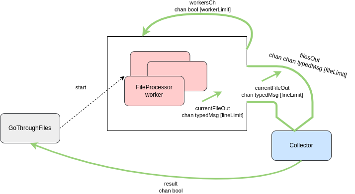
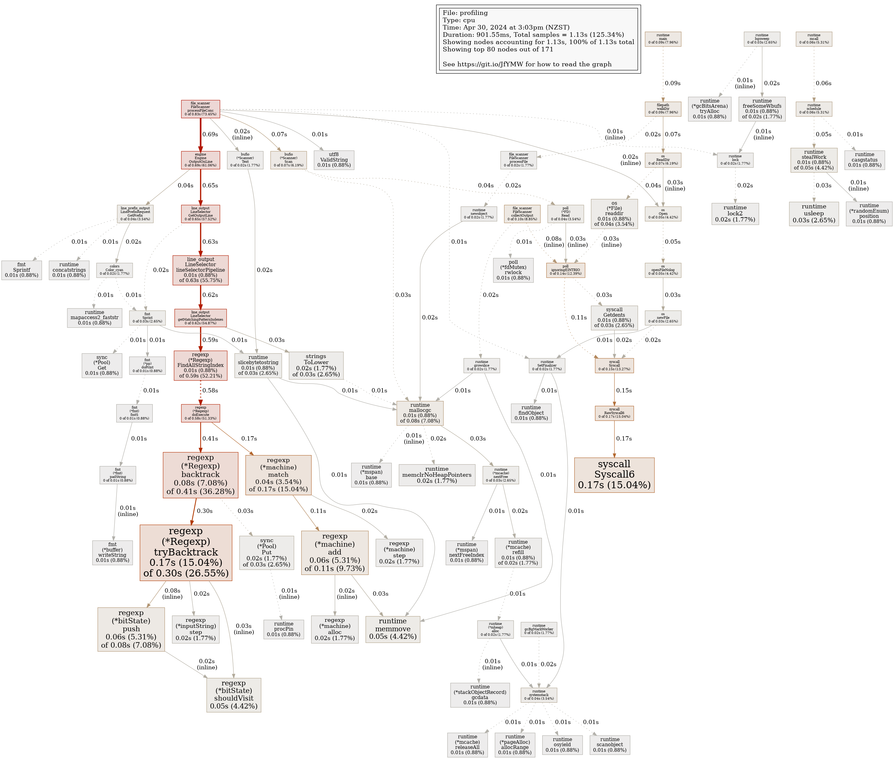

Making my own grep-like tool : find words and patterns from a text source

## How to use
Run with 
```
cd src/main
go run . [options...] keyword file...
```

Supported options :
- -i : search case insensitive
- -w : match word
- -x : match whole line
- -v : reverse (get lines not matching)
- -r : recursive (read all files under each directory)

Output control options :
- -o : only matching
- -c : count matching lines in file
- -L : get files without any match
- -l : get files with at least 1 match

Prefix options :
- -H : prefix with filename

Keyword format : Keyword is understood as a regexp (BRE basic format)

Regexp known limitations : 
- \\< (word start)
- \\> (word end)
- | ("|" char)

## Testing 
Run tests with
```
cd src/main
go test ./...
go test ./internal/package_folder/
go test ./... -cover
``` 

## Concurrency
The program is somewhat concurrent (file scanning part)



## Benchmarking

See [benchmark result notes](./benchmark/out/results.md)

## Profiling

Build profiling executable, execute it with -cpuprofile flag and get results in profiling.result
```
go build -o profiling/profiling profiling/profiling.go
./profiling/profiling -cpuprofile profiling/out/profiling.result
```

Generate a graph of profiling results :
```
go tool pprof -png -output=profiling/out/profiling1.png main profiling/out/profiling.result
```

Example of graph :


Generate architecture UML diagrams : 
```
goplantuml -recursive -show-aggregations /home/menseau/Documents/Go/learning_go/1_grep_like_tool > classdiagram.puml
```

```
godepgraph -s . | dot -Tpng -o depdiagram.png
```
