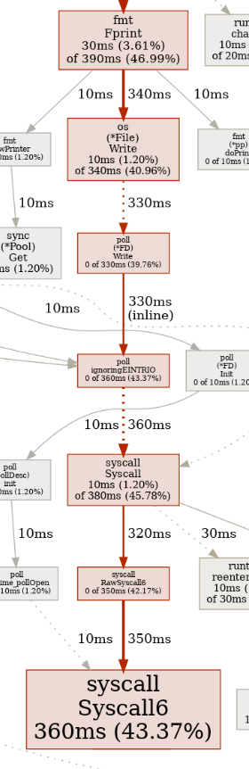
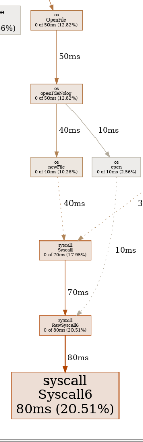

# Benchmark details

Input : -iwr defer\|func learning_go/0_go_class_matt_holiday

Folder contains ~ 2.5Mo, mostly Go files (txt files)

## Starting point : sequential program (62 ms)

This is the v0 of the program, it has all the basic features, it's sequential and I didn't try to make it fast in any way.

commit 80b6a51

See [out_seq20240405.txt](out_seq20240405.txt)

## First stop : concurrent program (97 ms)

I wanted to make the program concurrent as a challenge, I thought it would make the program faster, but it did not!

But as a side effect, it made me realize that error handling was far from good. When there's an issue with one of the files/line, the error message is messy : it's sometimes printed on stdErr, sometimes on stdOut ! Moreover, the error messages are displayed in an order which doesn't make sense.

commit 1d17447

See [out_ccr20240410.txt](out_ccr20240410.txt)

## Second stop : remove computing of same regex for all lines (13 ms)

By looking through the code, I noticed that I made a programming error. The regex object used behind the scene to find a keyword in a line was computed for each line. This is useless, as the keyword is the same throughout the entire life of line_select : so it made sense to create an object LineSelector, with a regex member (thus caching the regex and re-using it). It made the program faster beyond my expectations.

Also, in this benchmark, I had improved the error handling, by collecting concurrent output streams (found occurences and errors) in the right order.

commit 26d2434

See [out_regex20240411.txt](out_regex20240411.txt)

## Third stop : add buffer on printf (10 ms)

I was experimenting with the Go pprof profiler and trying to understand how it works, when I noticed that we spend between 30-45% of our time doing syscall because of how printing results on terminal is done. Actually, printing results on stdOut or stdErr was done line by line in collectOutput method, so to reduce this effort, I introduced a buffer for stdOut. The buffer is printed and flushed on every error, thus maintaining the errors order and limiting the number of calls to fmt.Print.

After this change, syscalls now take around 20% of program time.

Before stdOut buffer             |  After stdOut buffer
:-------------------------:|:-------------------------:
 | 

commit 4f4cc4ff

See [out_outbuf20240416.txt](out_outbuf20240416.txt)
